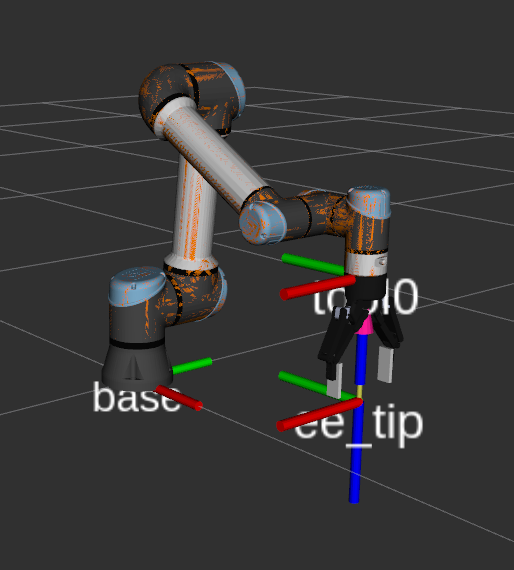

# Unique features compared to original realsense.cpp
- Multiple cameras GUI visualization
- Stream each camera on different ports
- Charuco board frame detection and visualization
- Refactored calibration.py with Spatial Algebra syntax so that it is very clear what transforms are happening


# Usage
## Calibration
- cd realsense
- Run realsense multicam in background

```
./realsense_multicam &
```

- Collect data

```
python3 calibrate.py
```

- Calculate poses

```
python3 calculate_poses_from_data_files.py
```

## Visualize combined pointcloud from all cameras
- python3 depth2pointcloud.py

# Docker notes
realsense_docker.dockerfile

- Confirmed working with realsense-viewer GUI
- Check if the host system can even detect it: https://github.com/IntelRealSense/librealsense/issues/3519
  - lsusb | grep Intel
  - lsusb -D /dev/bus/usb/002/026 | grep bcdUSB
- You must run setup_udev_rules.sh on the host machine for this to work
- You actually need 60-librealsense2-udev-rules.rules in /lib/udev/rules.d for some reason..


realsense_docker_from_source.dockerfile
- You need to build from source to get the #include/realsense/rs.hpp working
- OR figure out how to include that directory
- You need to run andy's realsense.cpp to setup the tcp connection
- https://dev.intelrealsense.com/docs/open-source-ethernet-networking-for-intel-realsense-depth-cameras


# Camera Calibration Settings
checkerboard_offset_from_tool is the translation of the Charuco board corner point from the tool center point frame

# Results
- Combined


- Combined showing each camera's points


# Pinhole camera model


# UR5e frames


# Notes
- Opencv does the axis as bgr instead of rgb
- Use ptype to get type of variable in GDB https://stackoverflow.com/questions/9568201/gdb-show-typeinfo-of-some-data
- gdb realsense_multicam

# Credits
- https://github.com/andyzeng/visual-pushing-grasping
